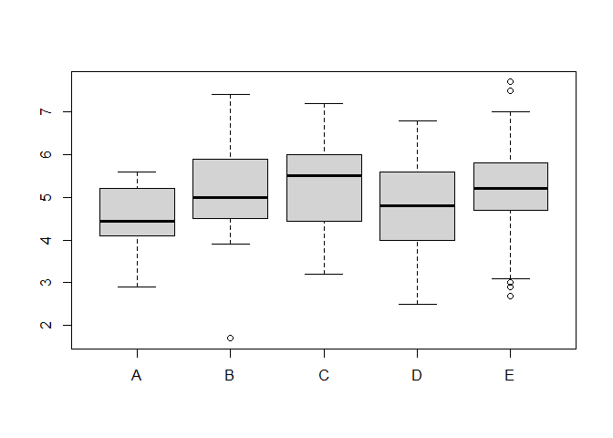
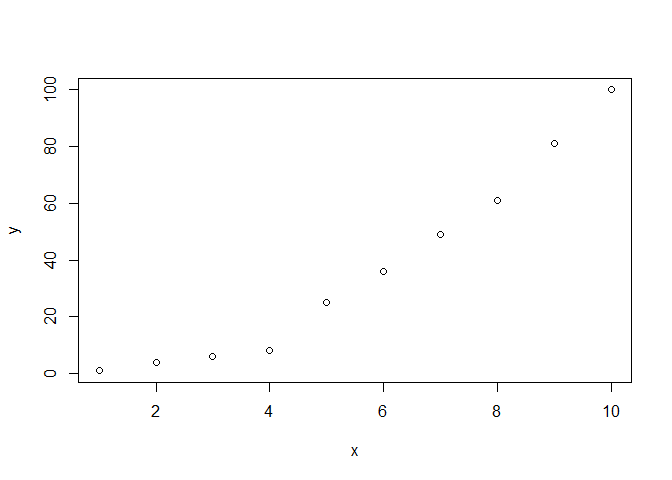
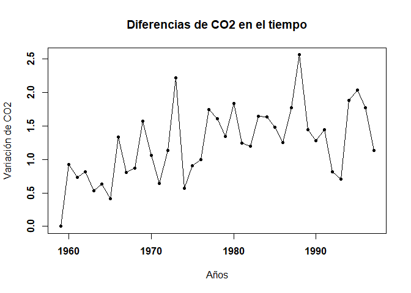
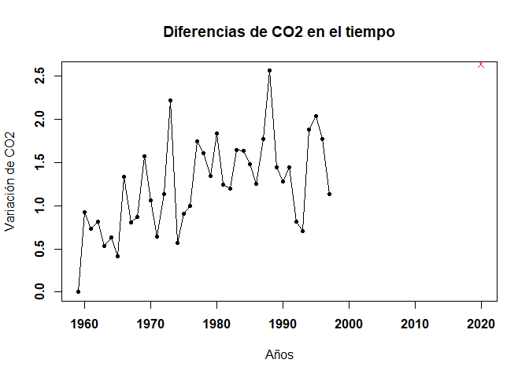

PROGRAMACION-GRUPO 17
================
Dayeli Ruiz-Nolberto Comeca-Angely Rojas
19/11/2021

## EJERCICIO 1: Calcula los valores numéricos aproximados

### 1.a

``` r
m<-0.3
n<-0.15
o<-0.2
p<-0.5
q<-0.12
r<-0.8
(m*n)+(o*r)+(p*q)
```

    ## [1] 0.265

``` r
m*n/{(m*n)+(o*r)+(p*q)}
```

    ## [1] 0.1698113

### 1.b

``` r
a<-5
b<-6
a^b
```

    ## [1] 15625

``` r
{a^b/factorial(b)}*exp(-b)
```

    ## [1] 0.05379236

### 1.c

``` r
choose(20,7)
```

    ## [1] 77520

``` r
c<-0.4
d<-0.6
choose(20,7)*c^7*d^13
```

    ## [1] 0.1658823

## EJERCICIO 2: Realizar la siguiente suma

### 2.a

``` r
N=1:1000
sum(N)
```

    ## [1] 500500

### 2.b

``` r
1^0+2^1+2^2+2^3+2^4+2^5+2^6+2^7+2^8+2^9+2^10
```

    ## [1] 2047

## EJERCICIO 3: El vector grupo representa el grupo al que pertenece una serie de alumnos

### 3.a ¿Cuántos elementos tiene?

``` r
load(url("https://goo.gl/uDzU8v"))
length(grupo)
```

    ## [1] 192

### 3.b ¿En qué posiciones del vector está la letra “A?”

``` r
which(grupo == "A")
```

    ##  [1]   2   8  17  21  28  84 101 108 111 115 123 136 190 192

## EJERCICIO 4: El vector nota representa la nota de un examen de los alumnos que están en los grupos del vector grupo

### 4.a ¿Cuanto suman todas las notas?

``` r
sum(nota)
```

    ## [1] 962

### 4.b ¿Cual es la media aritmética de todas las notas?

``` r
mean(nota)
```

    ## [1] 5.010417

### 4.c ¿En qué posiciones están las notas mayores de 7.0?

``` r
which(nota >7.0)
```

    ## [1]  81 103 120 151

### 4.d Visualiza las notas ordenadas de mayor a menor

``` r
sort(nota,TRUE)
```

    ##   [1] 7.7 7.5 7.4 7.2 7.0 6.9 6.9 6.8 6.8 6.8 6.8 6.8 6.6 6.5 6.4 6.4 6.4 6.4
    ##  [19] 6.3 6.2 6.2 6.2 6.2 6.2 6.2 6.1 6.1 6.1 6.1 6.0 6.0 6.0 6.0 6.0 6.0 5.9
    ##  [37] 5.9 5.9 5.9 5.9 5.9 5.9 5.9 5.9 5.8 5.8 5.8 5.8 5.8 5.7 5.7 5.7 5.7 5.7
    ##  [55] 5.6 5.6 5.6 5.6 5.6 5.6 5.5 5.5 5.5 5.5 5.5 5.5 5.5 5.5 5.5 5.5 5.5 5.5
    ##  [73] 5.5 5.4 5.4 5.4 5.4 5.4 5.4 5.4 5.4 5.3 5.3 5.3 5.3 5.2 5.2 5.2 5.2 5.2
    ##  [91] 5.2 5.2 5.1 5.0 5.0 5.0 5.0 5.0 5.0 5.0 5.0 5.0 4.9 4.9 4.9 4.9 4.9 4.9
    ## [109] 4.8 4.8 4.8 4.8 4.8 4.8 4.7 4.7 4.7 4.7 4.7 4.7 4.7 4.7 4.7 4.7 4.6 4.6
    ## [127] 4.6 4.6 4.5 4.5 4.5 4.5 4.5 4.5 4.4 4.4 4.4 4.4 4.4 4.4 4.4 4.3 4.3 4.3
    ## [145] 4.2 4.2 4.2 4.2 4.2 4.2 4.2 4.2 4.1 4.1 4.1 4.1 4.1 4.0 4.0 4.0 4.0 4.0
    ## [163] 4.0 3.9 3.9 3.8 3.8 3.8 3.7 3.7 3.7 3.7 3.6 3.6 3.6 3.5 3.4 3.4 3.4 3.4
    ## [181] 3.2 3.2 3.2 3.1 3.0 2.9 2.9 2.9 2.7 2.6 2.5 1.7

### 4.e ¿En qué posición está la nota máxima?

``` r
max(nota)
```

    ## [1] 7.7

``` r
which(nota==7.7)
```

    ## [1] 120

## EJERCICIO 5: A partir de los vectores grupo y nota definidos.

### 5.a Suma las notas de los 10 primeros alumnos del vector

``` r
sum(nota[c(1,2,3,4,5,6,7,8,9,10)])
```

    ## [1] 51.8

### 5.b ¿Cuántos alumnos hay del grupo C?

``` r
length(which(grupo=="C"))
```

    ## [1] 39

### 5.c ¿Cuántos alumnos han aprobado?

``` r
length(data.frame(nota)[data.frame(nota)$nota > 5,])
```

    ## [1] 93

### 5.d ¿Cuántos alumnos del grupo B han aprobado?

``` r
w<- data.frame(grupo,nota)
w[(w$grupo=="B") & (w$nota > 5),]
```

    ##     grupo nota
    ## 13      B  6.4
    ## 18      B  6.4
    ## 65      B  5.5
    ## 86      B  5.8
    ## 103     B  7.4
    ## 148     B  6.0
    ## 170     B  5.9
    ## 176     B  6.8
    ## 186     B  5.4
    ## 187     B  5.9

### 5.e ¿Qué porcentaje de alumnos del grupo C han aprobado?

``` r
j=w[(w$grupo=="C") & (w$nota > 5),]
22/39*100
```

    ## [1] 56.41026

### 5.f ¿De qué grupos son la máxima y mínima notas de toda la muestra?

``` r
w[w$nota == max(nota),]
```

    ##     grupo nota
    ## 120     E  7.7

``` r
w[w$nota == min(nota),]
```

    ##     grupo nota
    ## 142     B  1.7

### 5.g Nota media de los alumnos de grupo A y B, juntos, considerando sólo a los que han aprobado.

``` r
mean(nota[nota>5])
```

    ## [1] 5.901075

## EJERCICIO 6:

### Calcula el percentil 66 de las notas de todos los alumnos, y también de los alumnos del grupo C.

``` r
quantile(nota,66/100)
```

    ## 66% 
    ## 5.5

### Percentil de los alumnos del grupo C.

``` r
quantile(nota[c( which(grupo=="C"))],66/100)
```

    ##   66% 
    ## 5.808

## EJERCICIO 7: Un alumno tiene una nota de 4.9. ¿Qué porcentaje, del total de alumnos, tiene una nota menor o igual que la suya? ¿Y qué porcentaje tiene una nota mayor o igual que la suya?

``` r
length(data.frame(nota)[data.frame(nota)$nota>=4.9,])*100/192
```

    ## [1] 56.25

``` r
length(data.frame(nota)[data.frame(nota)$nota<=4.9,])*100/192
```

    ## [1] 46.875

## EJERCICIO 8: Realiza el gráfico de diagramas de caja de las notas de cada grupo, para poder comparar el nivel de cada uno de ellos.

``` r
v=data.frame(grupo, nota)
datA=v$nota[v$grupo=="A"]
datB=v$nota[v$grupo=="B"]
datC=v$nota[v$grupo=="C"]
datD=v$nota[v$grupo=="D"]
datE=v$nota[v$grupo=="E"]
valx=c("A","B","C","D","E")
boxplot(datA, datB, datC, datD, datE, names = valx)
```

<!-- -->
## EJERCICIO 9: Si la variable conc recoge la concentración de plomo (en
ppm) en el aire de cierta zona durante un día completo

### 9.a ¿Cuál ha sido la concentración máxima?

``` r
max(conc)
```

    ## [1] 47.34

### 9.b ¿En cuántos de los muestreos se ha superado la concentración de 40.0 ppm?

``` r
load(url("https://goo.gl/uDzU8v"))
length(data.frame(conc)[data.frame(conc)$conc>40,])
```

    ## [1] 61

### 9.c ¿Cuál ha sido la concentración media del día?

``` r
mean(conc)
```

    ## [1] 24.07229

### 9.d ¿Cuáles fueron las 10 mediciones más bajas del día?

``` r
head(sort(conc),10)
```

    ##  [1] 0.93 1.07 1.77 2.03 2.58 2.73 2.75 2.88 2.88 2.91

## PARTE 2

### EJERCICIO 1: Graficar los puntos (1,1),(2,4),(3,6),(4,8),(5,25),(6,36),(7,49),(8,61),(9,81),(10,100) en un plano utilizando RStudio.

``` r
x<-c(1,2,3,4,5,6,7,8,9,10)
y<-c(1,4,6,8,25,36,49,61,81,100)
plot(x,y)
```

<!-- -->
### EJERCICIO 2: Ingresar la matriz A en RStudio

``` r
matrix(c(1,2,3,4,2,4,6,8,3,6,9,12), nrow = 4 , ncol = 3)
```

    ##      [,1] [,2] [,3]
    ## [1,]    1    2    3
    ## [2,]    2    4    6
    ## [3,]    3    6    9
    ## [4,]    4    8   12

### EJERCICIO 3: Ingresar la matriz identidad de tamaño 3I

``` r
I<- diag(3)
```

### EJERCICIO 4: Crea una función que cree una matriz nula ingresando las dimensiones

``` r
c(0,0,0,0,0,0,0,0,0,0)
```

    ##  [1] 0 0 0 0 0 0 0 0 0 0

``` r
matrix(data =c(0,0,0,0,0,0,0,0,0,0),2,3)
```

    ## Warning in matrix(data = c(0, 0, 0, 0, 0, 0, 0, 0, 0, 0), 2, 3): la longitud de
    ## los datos [10] no es un submúltiplo o múltiplo del número de columnas [3] en la
    ## matriz

    ##      [,1] [,2] [,3]
    ## [1,]    0    0    0
    ## [2,]    0    0    0

### EJERCICIO 5: Modificar la matriz diag(4), para que se parezca a la matriz B

``` r
B=diag(4)
B[1,1]=0
B[2,2]=2
B[3,3]=3
B[4,4]=4
```

### EJERCICIO 6: Obtener la matriz transpuesta de A (ejercicio 2)

``` r
A<-matrix(c(1,2,3,4,2,4,6,8,3,6,9,12,0,0,0,0),4,4)
t(A)
```

    ##      [,1] [,2] [,3] [,4]
    ## [1,]    1    2    3    4
    ## [2,]    2    4    6    8
    ## [3,]    3    6    9   12
    ## [4,]    0    0    0    0

### EJERCICIO 7: Realizar las siguientes operaciones A+B , A−B , 3B y AB

``` r
c(1,2,3,4,2,4,6,8,3,6,9,12,0,0,0,0)
```

    ##  [1]  1  2  3  4  2  4  6  8  3  6  9 12  0  0  0  0

``` r
A<-matrix(c(1,2,3,4,2,4,6,8,3,6,9,12,0,0,0,0),4,4)
matrix(c(1,2,3,4,2,4,6,8,3,6,9,12,0,0,0,0),4,4)
```

    ##      [,1] [,2] [,3] [,4]
    ## [1,]    1    2    3    0
    ## [2,]    2    4    6    0
    ## [3,]    3    6    9    0
    ## [4,]    4    8   12    0

``` r
c(0,0,0,0,2,0,0,0,0,3,0,0,0,0,0,4)
```

    ##  [1] 0 0 0 0 2 0 0 0 0 3 0 0 0 0 0 4

``` r
B<-matrix(c(0,0,0,0,2,0,0,0,0,3,0,0,0,0,0,4),4,4)
matrix(c(0,0,0,0,2,0,0,0,0,3,0,0,0,0,0,4),4,4)
```

    ##      [,1] [,2] [,3] [,4]
    ## [1,]    0    2    0    0
    ## [2,]    0    0    3    0
    ## [3,]    0    0    0    0
    ## [4,]    0    0    0    4

``` r
A+B
```

    ##      [,1] [,2] [,3] [,4]
    ## [1,]    1    4    3    0
    ## [2,]    2    4    9    0
    ## [3,]    3    6    9    0
    ## [4,]    4    8   12    4

``` r
A-B
```

    ##      [,1] [,2] [,3] [,4]
    ## [1,]    1    0    3    0
    ## [2,]    2    4    3    0
    ## [3,]    3    6    9    0
    ## [4,]    4    8   12   -4

``` r
3*B
```

    ##      [,1] [,2] [,3] [,4]
    ## [1,]    0    6    0    0
    ## [2,]    0    0    9    0
    ## [3,]    0    0    0    0
    ## [4,]    0    0    0   12

``` r
A%*%B
```

    ##      [,1] [,2] [,3] [,4]
    ## [1,]    0    2    6    0
    ## [2,]    0    4   12    0
    ## [3,]    0    6   18    0
    ## [4,]    0    8   24    0

### EJERCICIO 8: Crea una función para calcular P6

``` r
P=matrix(c(1,-2,1,2,4,0,3,-2,1), ncol=3, nrow=3)
p6=function(x){x^6}
p6(P)
```

    ##      [,1] [,2] [,3]
    ## [1,]    1   64  729
    ## [2,]   64 4096   64
    ## [3,]    1    0    1

### EJERCICIO 9: Resolver el sistema de ecuaciones

``` r
D<-matrix(c(3,9,3,-1,-2,1,1,1,-2), ncol=3,nrow=3)
W<-c(-1,-9,-9)
solve(D,W)
```

    ## [1] -1  2  4

### EJERCICIO 10: Utilizando la ayuda de R, investigue para qué sirven las funciones eigen() y det()

``` r
A<-matrix(c(1,2,3,4,2,4,6,8,3,6,9,12,0,0,0,0),4,4)
matrix(c(1,2,3,4,2,4,6,8,3,6,9,12,0,0,0,0),4,4)
```

    ##      [,1] [,2] [,3] [,4]
    ## [1,]    1    2    3    0
    ## [2,]    2    4    6    0
    ## [3,]    3    6    9    0
    ## [4,]    4    8   12    0

``` r
eigen(A)
```

    ## eigen() decomposition
    ## $values
    ## [1] 14  0  0  0
    ## 
    ## $vectors
    ##           [,1] [,2]       [,3]       [,4]
    ## [1,] 0.1825742    0  0.1690309  0.9486833
    ## [2,] 0.3651484    0 -0.8451543  0.0000000
    ## [3,] 0.5477226    0  0.5070926 -0.3162278
    ## [4,] 0.7302967    1  0.0000000  0.0000000

``` r
det(A)
```

    ## [1] 0

### EJERCICIO 11: Calcular A⋅B-ABt

``` r
c1=1:10
c2=seq(2,20,2)
c3=seq(3,30,3)
c4=seq(4,40,4)
c5=seq(5,50,5)
mtB=cbind(c1,c2,c3,c4,c5)
mtA=rbind(c(0,1,0,1,0), c(1,0,1,0,1), c(0,1,0,1,0), 
          c(0,1,0,0,1), c(1,0,1,1,0))
mtA_tr=t(mtA)
mtB %*% mtA - mtB %*% mtA_tr
```

    ##       [,1] [,2] [,3] [,4] [,5]
    ##  [1,]    1   -1    1    2   -2
    ##  [2,]    2   -2    2    4   -4
    ##  [3,]    3   -3    3    6   -6
    ##  [4,]    4   -4    4    8   -8
    ##  [5,]    5   -5    5   10  -10
    ##  [6,]    6   -6    6   12  -12
    ##  [7,]    7   -7    7   14  -14
    ##  [8,]    8   -8    8   16  -16
    ##  [9,]    9   -9    9   18  -18
    ## [10,]   10  -10   10   20  -20

### EJERCICIO 12: Determine la matriz ^β

``` r
H <-matrix(c(1,1,1,1,1,1,-1,0,1,2), nrow = 5 , ncol = 2)
H
```

    ##      [,1] [,2]
    ## [1,]    1    1
    ## [2,]    1   -1
    ## [3,]    1    0
    ## [4,]    1    1
    ## [5,]    1    2

``` r
G <- matrix(c(0,0,1,1,3), nrow = 5 , ncol = 1)
G
```

    ##      [,1]
    ## [1,]    0
    ## [2,]    0
    ## [3,]    1
    ## [4,]    1
    ## [5,]    3

``` r
Z<- t(H)
Z
```

    ##      [,1] [,2] [,3] [,4] [,5]
    ## [1,]    1    1    1    1    1
    ## [2,]    1   -1    0    1    2

``` r
R<-(Z%*%H)
U<-solve(R,Z)
U%*%G
```

    ##           [,1]
    ## [1,] 0.5384615
    ## [2,] 0.7692308

### EJERCICIO 13: El vector co2 contiene medidas de CO2 en la atmósfera, en unidades de ppm, durante el periodo 1959-1997. El vector year contiene sus años correspondientes.Calcular un vector de diferencias de CO2entre años consecutivos, que sería:CO2en 1960 menos CO en 1959 CO2 en 1961 menos CO2en 1960 y así sucesivamente.. Crear un plot con lineas y puntos mostrando las diferencias consecutivas de CO2 en función del tiempo (1960, 1961, etc…), en negrita La diferencia de concentración de CO2entre 2020 y 2019 fue igual a 2.64. Agregar un punto rojo representando esa diferencia al plot ya creado (usar una forma diferente, como pch=4)

``` r
data(co2)
means = aggregate(co2, FUN=mean)
year = as.vector(time(means))
co2 = as.vector(means)

#13.a
diff(co2)
```

    ##  [1] 0.9216667 0.7375000 0.8125000 0.5350000 0.6300000 0.4100000 1.3375000
    ##  [8] 0.8100000 0.8700000 1.5691667 1.0583333 0.6375000 1.1383333 2.2183333
    ## [15] 0.5675000 0.9066667 1.0000000 1.7441667 1.6058333 1.3450000 1.8341667
    ## [22] 1.2458333 1.1983333 1.6491667 1.6383333 1.4791667 1.2491667 1.7758333
    ## [29] 2.5625000 1.4408333 1.2825000 1.4416667 0.8133333 0.7041667 1.8841667
    ## [36] 2.0341667 1.7725000 1.1308333

``` r
#13.b
y<-c(0, diff(co2))
x<-year
plot(x,y,xlab="Años",ylab="Variación de CO2",type="o",pch=20, font=2,main= "Diferencias de CO2 en el tiempo")
```

<!-- -->

``` r
#13.c
plot(x,y,xlim=c(1959,2020),xlab="Años",ylab="Variación de CO2",type="o",pch=20, font=2,main= "Diferencias de CO2 en el tiempo")
points(2020,y=2.64,col="red",pch=4)
```

<!-- -->
### EJERCICIO 14: Calcula e imprime un vector con los nombres de las
estaciones donde al menos uno de los meses tiene una precipitación
superior a 180mm.

``` r
nbc=read.csv("C:/Users/Asus/Downloads/rainfall (1).csv")
nbc[nbc$sep>180,]
```

    ##  [1] num      altitude sep      oct      nov      dec      jan      feb     
    ##  [9] mar      apr      may      name     x_utm    y_utm   
    ## <0 rows> (or 0-length row.names)

``` r
nbc[nbc$oct>180,]
```

    ##  [1] num      altitude sep      oct      nov      dec      jan      feb     
    ##  [9] mar      apr      may      name     x_utm    y_utm   
    ## <0 rows> (or 0-length row.names)

``` r
nbc[nbc$nov>180,]
```

    ##  [1] num      altitude sep      oct      nov      dec      jan      feb     
    ##  [9] mar      apr      may      name     x_utm    y_utm   
    ## <0 rows> (or 0-length row.names)

``` r
nbc[nbc$dec>180,]
```

    ##       num altitude sep oct nov dec jan feb mar apr  may     name    x_utm
    ## 77 212168      825 3.4  37 122 202 238 190 114  38 12.2 Horashim 717491.2
    ##      y_utm
    ## 77 3648872

``` r
nbc[nbc$jan>180,]
```

    ##        num altitude sep oct nov dec jan feb mar apr  may       name    x_utm
    ## 66 2496029      940 1.9  22  86 159 201 196 115  40  9.1 Golan Farm 761589.2
    ## 71  210748      300 3.7  36 112 160 201 153  92  34  9.5      Eilon 706938.1
    ## 72  210902      600 2.6  35 106 162 205 179 106  35  7.8    Fasutta 715879.5
    ## 73  211350      380 2.3  36 115 169 204 160  95  32  9.1     Yehiam 708299.6
    ## 74  211415      480 3.2  30 112 170 209 183 105  35  8.3 Kfar Mahol 716009.6
    ## 75  211600      680 2.3  28 100 171 220 192 109  34  7.6      Meron 727711.5
    ## 77  212168      825 3.4  37 122 202 238 190 114  38 12.2   Horashim 717491.2
    ##      y_utm
    ## 66 3669108
    ## 71 3660756
    ## 72 3658943
    ## 73 3653081
    ## 74 3652743
    ## 75 3652888
    ## 77 3648872

``` r
nbc[nbc$feb>180,]
```

    ##        num altitude sep oct nov dec jan feb mar apr  may       name    x_utm
    ## 66 2496029      940 1.9  22  86 159 201 196 115  40  9.1 Golan Farm 761589.2
    ## 74  211415      480 3.2  30 112 170 209 183 105  35  8.3 Kfar Mahol 716009.6
    ## 75  211600      680 2.3  28 100 171 220 192 109  34  7.6      Meron 727711.5
    ## 77  212168      825 3.4  37 122 202 238 190 114  38 12.2   Horashim 717491.2
    ##      y_utm
    ## 66 3669108
    ## 74 3652743
    ## 75 3652888
    ## 77 3648872

``` r
nbc[nbc$mar>180,]
```

    ##  [1] num      altitude sep      oct      nov      dec      jan      feb     
    ##  [9] mar      apr      may      name     x_utm    y_utm   
    ## <0 rows> (or 0-length row.names)

``` r
nbc[nbc$apr>180,]
```

    ##  [1] num      altitude sep      oct      nov      dec      jan      feb     
    ##  [9] mar      apr      may      name     x_utm    y_utm   
    ## <0 rows> (or 0-length row.names)

``` r
nbc[nbc$may>180,]
```

    ##  [1] num      altitude sep      oct      nov      dec      jan      feb     
    ##  [9] mar      apr      may      name     x_utm    y_utm   
    ## <0 rows> (or 0-length row.names)

``` r
vector14.b=c("Golan Farm","Eilon","Fasutta","Yehiam","Kfar Mahol","Meron",
  "Horashim")
```
